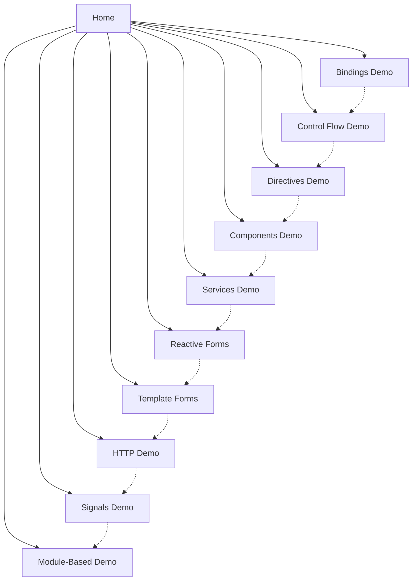

# Design Document: Angular 18 Learning Project

## Overview

This design outlines an Angular 18 learning project that demonstrates core Angular concepts through practical, hands-on examples. The project uses standalone components as the primary architecture, showcases Angular 18's signal-based reactivity, and demonstrates the new control flow syntax (@if, @for, @switch).

The application is structured as a single-page application with multiple demo sections accessible through a navigation menu. Each section focuses on a specific Angular concept with working examples and inline documentation.

### Key Design Principles

- **Standalone-first architecture**: Leverage Angular 18's standalone components to reduce boilerplate
- **Practical demonstrations**: Each concept includes working, interactive examples
- **Progressive complexity**: Start with basic concepts (bindings) and progress to advanced (signals, HTTP)
- **Inline documentation**: Code comments explain what each example demonstrates
- **No testing infrastructure**: Focus purely on implementation for rapid development

## Architecture

### Application Structure

```
src/
├── app/
│   ├── app.component.ts (root standalone component)
│   ├── app.config.ts (application configuration)
│   ├── app.routes.ts (routing configuration)
│   │
│   ├── core/
│   │   ├── services/
│   │   │   ├── data.service.ts
│   │   │   └── user.service.ts
│   │   └── models/
│   │       └── user.model.ts
│   │
│   ├── shared/
│   │   ├── directives/
│   │   │   ├── highlight.directive.ts
│   │   │   └── unless.directive.ts
│   │   └── components/
│   │       └── demo-container.component.ts
│   │
│   └── features/
│       ├── home/
│       │   └── home.component.ts
│       ├── bindings/
│       │   └── bindings-demo.component.ts
│       ├── control-flow/
│       │   └── control-flow-demo.component.ts
│       ├── directives/
│       │   └── directives-demo.component.ts
│       ├── components/
│       │   ├── components-demo.component.ts
│       │   ├── parent.component.ts
│       │   ├── child.component.ts
│       │   └── lifecycle.component.ts
│       ├── services/
│       │   └── services-demo.component.ts
│       ├── forms/
│       │   ├── reactive-form.component.ts
│       │   └── template-form.component.ts
│       ├── http/
│       │   └── http-demo.component.ts
│       ├── signals/
│       │   └── signals-demo.component.ts
│       └── module-based/
│           ├── module-demo.component.ts
│           └── module-demo.module.ts
│
├── assets/
├── styles.css
├── main.ts
└── index.html
```

### Routing Architecture

The application uses Angular Router with standalone components. Routes are defined in `app.routes.ts` and include:

- `/` - Home page with project overview
- `/bindings` - Data binding demonstrations
- `/control-flow` - @if, @for, @switch examples
- `/directives` - Structural and attribute directives
- `/components` - Component communication and lifecycle
- `/services` - Dependency injection and services
- `/forms/reactive` - Reactive forms
- `/forms/template` - Template-driven forms
- `/http` - HTTP client and observables
- `/signals` - Signal-based reactivity
- `/module-based` - Traditional NgModule example

### Navigation Flow



## Components and Interfaces

### Core Application Components

#### AppComponent (Root)
```typescript
@Component({
  selector: 'app-root',
  standalone: true,
  imports: [RouterOutlet, RouterLink, RouterLinkActive],
  template: `
    <nav>
      <a routerLink="/" routerLinkActive="active">Home</a>
      <a routerLink="/bindings" routerLinkActive="active">Bindings</a>
      <!-- Additional navigation links -->
    </nav>
    <main>
      <router-outlet />
    </main>
  `
})
```

**Responsibilities:**
- Provide main navigation menu
- Host router outlet for child routes
- Apply consistent layout structure

#### HomeComponent
```typescript
@Component({
  selector: 'app-home',
  standalone: true,
  template: `
    <h1>Angular 18 Learning Project</h1>
    <p>Explore Angular concepts through interactive demos</p>
    <section>
      <h2>What You'll Learn</h2>
      <ul>
        <li>Data Binding</li>
        <li>Control Flow (@if, @for, @switch)</li>
        <!-- Additional topics -->
      </ul>
    </section>
  `
})
```

**Responsibilities:**
- Welcome message and project overview
- List of available demos
- Quick start instructions

### Feature Components

#### BindingsDemoComponent
```typescript
@Component({
  selector: 'app-bindings-demo',
  standalone: true,
  imports: [FormsModule],
  template: `
    <h2>Data Binding Examples</h2>
    
    <!-- Interpolation -->
    <section>
      <h3>Interpolation</h3>
      <p>{{ message }}</p>
    </section>
    
    <!-- Property Binding -->
    <section>
      <h3>Property Binding</h3>
      
      <button [disabled]="isDisabled">Click Me</button>
    </section>
    
    <!-- Event Binding -->
    <section>
      <h3>Event Binding</h3>
      <button (click)="handleClick()">Click Event</button>
      <input (input)="handleInput($event)">
    </section>
    
    <!-- Two-way Binding -->
    <section>
      <h3>Two-way Binding</h3>
      <input [(ngModel)]="name">
      <p>Hello, {{ name }}!</p>
    </section>
  `
})
```

**Responsibilities:**
- Demonstrate all four binding types
- Show real-time updates
- Include explanatory text

#### ControlFlowDemoComponent
```typescript
@Component({
  selector: 'app-control-flow-demo',
  standalone: true,
  template: `
    <h2>Angular 18 Control Flow</h2>
    
    <!-- @if example -->
    <section>
      <h3>@if Syntax</h3>
      <button (click)="toggleShow()">Toggle</button>
      @if (showContent) {
        <p>Content is visible!</p>
      } @else {
        <p>Content is hidden!</p>
      }
    </section>
    
    <!-- @for example -->
    <section>
      <h3>@for Syntax</h3>
      @for (item of items; track item.id) {
        <div>{{ item.name }}</div>
      }
    </section>
    
    <!-- @switch example -->
    <section>
      <h3>@switch Syntax</h3>
      <select [(ngModel)]="selectedOption">
        <option value="a">Option A</option>
        <option value="b">Option B</option>
        <option value="c">Option C</option>
      </select>
      @switch (selectedOption) {
        @case ('a') { <p>You selected A</p> }
        @case ('b') { <p>You selected B</p> }
        @default { <p>You selected C</p> }
      }
    </section>
  `
})
```

**Responsibilities:**
- Demonstrate @if, @else, @else if
- Demonstrate @for with track
- Demonstrate @switch, @case, @default
- Include comments comparing to legacy syntax

#### DirectivesDemoComponent
```typescript
@Component({
  selector: 'app-directives-demo',
  standalone: true,
  imports: [NgClass, NgStyle, FormsModule, HighlightDirective, UnlessDirective],
  template: `
    <h2>Directives</h2>
    
    <!-- Built-in Attribute Directives -->
    <section>
      <h3>ngClass</h3>
      <div [ngClass]="{'active': isActive, 'disabled': !isActive}">
        Dynamic classes
      </div>
      
      <h3>ngStyle</h3>
      <div [ngStyle]="{'color': textColor, 'font-size': fontSize + 'px'}">
        Dynamic styles
      </div>
    </section>
    
    <!-- Custom Directives -->
    <section>
      <h3>Custom Highlight Directive</h3>
      <p appHighlight [highlightColor]="'yellow'">
        This text has custom highlighting
      </p>
      
      <h3>Custom Structural Directive</h3>
      <p *appUnless="showContent">
        This uses a custom structural directive
      </p>
    </section>
  `
})
```

**Responsibilities:**
- Demonstrate ngClass, ngStyle, ngModel
- Show custom attribute directive
- Show custom structural directive
- Visual feedback for directive effects

#### ComponentsDemoComponent (Parent)
```typescript
@Component({
  selector: 'app-components-demo',
  standalone: true,
  imports: [ChildComponent, LifecycleComponent],
  template: `
    <h2>Component Communication</h2>
    
    <section>
      <h3>Parent-Child Communication</h3>
      <app-child 
        [message]="parentMessage"
        (notify)="handleChildEvent($event)">
      </app-child>
      <p>Child says: {{ childMessage }}</p>
    </section>
    
    <section>
      <h3>Lifecycle Hooks</h3>
      <button (click)="toggleLifecycle()">Toggle Lifecycle Component</button>
      @if (showLifecycle) {
        <app-lifecycle [data]="lifecycleData"></app-lifecycle>
      }
    </section>
  `
})
```

**Responsibilities:**
- Demonstrate @Input and @Output
- Show parent-child communication
- Demonstrate lifecycle hooks with console logging

#### ChildComponent
```typescript
@Component({
  selector: 'app-child',
  standalone: true,
  template: `
    <div>
      <p>Message from parent: {{ message }}</p>
      <button (click)="sendToParent()">Send to Parent</button>
    </div>
  `
})
export class ChildComponent {
  @Input() message: string = '';
  @Output() notify = new EventEmitter<string>();
  
  sendToParent() {
    this.notify.emit('Hello from child!');
  }
}
```

**Responsibilities:**
- Receive data via @Input
- Emit events via @Output
- Demonstrate child component patterns

#### ReactiveFormComponent
```typescript
@Component({
  selector: 'app-reactive-form',
  standalone: true,
  imports: [ReactiveFormsModule],
  template: `
    <h2>Reactive Form</h2>
    <form [formGroup]="userForm" (ngSubmit)="onSubmit()">
      <div>
        <label>Name:</label>
        <input formControlName="name">
        @if (userForm.get('name')?.invalid && userForm.get('name')?.touched) {
          <span class="error">Name is required</span>
        }
      </div>
      
      <div>
        <label>Email:</label>
        <input formControlName="email">
        @if (userForm.get('email')?.hasError('email')) {
          <span class="error">Invalid email</span>
        }
      </div>
      
      <div>
        <label>Age:</label>
        <input type="number" formControlName="age">
        @if (userForm.get('age')?.hasError('min')) {
          <span class="error">Age must be at least 18</span>
        }
      </div>
      
      <button type="submit" [disabled]="userForm.invalid">Submit</button>
    </form>
    
    <div>
      <h3>Form Value:</h3>
      <pre>{{ userForm.value | json }}</pre>
      <p>Valid: {{ userForm.valid }}</p>
    </div>
  `
})
```

**Responsibilities:**
- Demonstrate FormGroup and FormControl
- Show built-in validators
- Show custom validators
- Display validation errors
- Show form value and status

#### TemplateFormComponent
```typescript
@Component({
  selector: 'app-template-form',
  standalone: true,
  imports: [FormsModule],
  template: `
    <h2>Template-Driven Form</h2>
    <form #userForm="ngForm" (ngSubmit)="onSubmit(userForm)">
      <div>
        <label>Username:</label>
        <input 
          name="username" 
          [(ngModel)]="user.username" 
          required 
          #username="ngModel">
        @if (username.invalid && username.touched) {
          <span class="error">Username is required</span>
        }
      </div>
      
      <div>
        <label>Email:</label>
        <input 
          name="email" 
          [(ngModel)]="user.email" 
          required 
          email 
          #email="ngModel">
        @if (email.invalid && email.touched) {
          <span class="error">Invalid email</span>
        }
      </div>
      
      <button type="submit" [disabled]="userForm.invalid">Submit</button>
    </form>
    
    <div>
      <h3>Submitted Data:</h3>
      <pre>{{ submittedData | json }}</pre>
    </div>
  `
})
```

**Responsibilities:**
- Demonstrate ngModel two-way binding
- Show template reference variables
- Show template validation
- Display submitted values

#### HttpDemoComponent
```typescript
@Component({
  selector: 'app-http-demo',
  standalone: true,
  imports: [AsyncPipe, JsonPipe],
  template: `
    <h2>HTTP Client & Observables</h2>
    
    <section>
      <h3>GET Request</h3>
      <button (click)="loadUsers()">Load Users</button>
      @if (users$ | async; as users) {
        <ul>
          @for (user of users; track user.id) {
            <li>{{ user.name }} - {{ user.email }}</li>
          }
        </ul>
      }
    </section>
    
    <section>
      <h3>POST Request</h3>
      <button (click)="createUser()">Create User</button>
      @if (createdUser$ | async; as user) {
        <p>Created: {{ user | json }}</p>
      }
    </section>
    
    <section>
      <h3>Error Handling</h3>
      <button (click)="loadWithError()">Trigger Error</button>
      @if (error) {
        <p class="error">{{ error }}</p>
      }
    </section>
  `
})
```

**Responsibilities:**
- Demonstrate GET and POST requests
- Show async pipe usage
- Show observable subscription
- Demonstrate error handling
- Show observable operators (map, catchError)

#### SignalsDemoComponent
```typescript
@Component({
  selector: 'app-signals-demo',
  standalone: true,
  template: `
    <h2>Signal-Based Reactivity</h2>
    
    <section>
      <h3>Basic Signal</h3>
      <p>Count: {{ count() }}</p>
      <button (click)="increment()">Increment</button>
      <button (click)="decrement()">Decrement</button>
    </section>
    
    <section>
      <h3>Computed Signal</h3>
      <p>Double Count: {{ doubleCount() }}</p>
      <p>Is Even: {{ isEven() }}</p>
    </section>
    
    <section>
      <h3>Signal with Objects</h3>
      <p>User: {{ user().name }} ({{ user().age }})</p>
      <button (click)="updateUser()">Update User</button>
    </section>
    
    <section>
      <h3>Effect Example</h3>
      <p>Check console for effect logs</p>
    </section>
  `
})
```

**Responsibilities:**
- Demonstrate signal() creation
- Show computed() for derived state
- Show effect() for side effects
- Demonstrate set() and update() methods
- Show automatic UI updates

### Services

#### DataService
```typescript
@Injectable({
  providedIn: 'root'
})
export class DataService {
  private dataSignal = signal<string[]>([]);
  
  getData(): string[] {
    return this.dataSignal();
  }
  
  addData(item: string): void {
    this.dataSignal.update(data => [...data, item]);
  }
  
  clearData(): void {
    this.dataSignal.set([]);
  }
}
```

**Responsibilities:**
- Provide shared data across components
- Demonstrate signal-based state management
- Show service injection patterns

#### UserService
```typescript
@Injectable({
  providedIn: 'root'
})
export class UserService {
  private http = inject(HttpClient);
  
  getUsers(): Observable<User[]> {
    return this.http.get<User[]>('https://jsonplaceholder.typicode.com/users');
  }
  
  createUser(user: User): Observable<User> {
    return this.http.post<User>('https://jsonplaceholder.typicode.com/users', user);
  }
  
  getUserById(id: number): Observable<User> {
    return this.http.get<User>(`https://jsonplaceholder.typicode.com/users/${id}`);
  }
}
```

**Responsibilities:**
- Handle HTTP requests
- Demonstrate inject() function
- Return observables for async operations

### Custom Directives

#### HighlightDirective (Attribute)
```typescript
@Directive({
  selector: '[appHighlight]',
  standalone: true
})
export class HighlightDirective {
  @Input() highlightColor: string = 'yellow';
  
  constructor(private el: ElementRef) {}
  
  @HostListener('mouseenter') onMouseEnter() {
    this.highlight(this.highlightColor);
  }
  
  @HostListener('mouseleave') onMouseLeave() {
    this.highlight('');
  }
  
  private highlight(color: string) {
    this.el.nativeElement.style.backgroundColor = color;
  }
}
```

**Responsibilities:**
- Demonstrate custom attribute directive
- Show @HostListener usage
- Show ElementRef manipulation

#### UnlessDirective (Structural)
```typescript
@Directive({
  selector: '[appUnless]',
  standalone: true
})
export class UnlessDirective {
  private hasView = false;
  
  constructor(
    private templateRef: TemplateRef<any>,
    private viewContainer: ViewContainerRef
  ) {}
  
  @Input() set appUnless(condition: boolean) {
    if (!condition && !this.hasView) {
      this.viewContainer.createEmbeddedView(this.templateRef);
      this.hasView = true;
    } else if (condition && this.hasView) {
      this.viewContainer.clear();
      this.hasView = false;
    }
  }
}
```

**Responsibilities:**
- Demonstrate custom structural directive
- Show TemplateRef and ViewContainerRef usage
- Implement opposite of *ngIf

### Module-Based Example

#### ModuleDemoModule
```typescript
@NgModule({
  declarations: [ModuleDemoComponent],
  imports: [CommonModule],
  exports: [ModuleDemoComponent]
})
export class ModuleDemoModule {}
```

**Responsibilities:**
- Show traditional NgModule pattern
- Demonstrate declarations, imports, exports
- Contrast with standalone components

## Data Models

### User Model
```typescript
export interface User {
  id: number;
  name: string;
  email: string;
  age?: number;
}
```

### FormData Model
```typescript
export interface FormData {
  name: string;
  email: string;
  age: number;
  address?: string;
  phone?: string;
}
```

### DemoItem Model
```typescript
export interface DemoItem {
  id: number;
  name: string;
  description: string;
  category: string;
}
```

## Error Handling

### HTTP Error Handling

All HTTP requests will implement error handling using RxJS operators:

```typescript
getUsers(): Observable<User[]> {
  return this.http.get<User[]>(this.apiUrl).pipe(
    catchError(error => {
      console.error('Error loading users:', error);
      return of([]);
    })
  );
}
```

### Form Validation Errors

Forms will display user-friendly error messages:

```typescript
getErrorMessage(control: AbstractControl, fieldName: string): string {
  if (control.hasError('required')) {
    return `${fieldName} is required`;
  }
  if (control.hasError('email')) {
    return 'Invalid email format';
  }
  if (control.hasError('minlength')) {
    return `${fieldName} must be at least ${control.errors?.['minlength'].requiredLength} characters`;
  }
  return '';
}
```

### Router Error Handling

Navigation errors will be caught and logged:

```typescript
this.router.navigate(['/path']).catch(error => {
  console.error('Navigation error:', error);
});
```

## Testing Strategy

Per user requirements, this project will not include any testing infrastructure. The focus is on rapid development and practical demonstration of Angular concepts without test files or testing configurations.

## Implementation Notes

### Development Approach

1. **Bootstrap Angular 18 project** with standalone components
2. **Set up routing** with all demo routes
3. **Create navigation** structure in AppComponent
4. **Implement demos** in order of complexity:
   - Home page
   - Bindings demo
   - Control flow demo
   - Directives demo
   - Components demo
   - Services demo
   - Forms demos
   - HTTP demo
   - Signals demo
   - Module-based demo
5. **Add styling** for consistent layout
6. **Add documentation** with inline comments

### Key Angular 18 Features to Highlight

- **Standalone components**: Default architecture, no NgModule needed
- **Signal-based reactivity**: New reactive primitive for state management
- **New control flow**: @if, @for, @switch syntax
- **inject() function**: Alternative to constructor injection
- **Improved TypeScript support**: Better type inference

### Configuration Files

#### angular.json
Standard Angular CLI configuration with:
- Build configurations for development
- Asset management
- Style preprocessing
- No test configurations

#### tsconfig.json
TypeScript configuration with:
- Strict mode enabled
- ES2022 target
- Module resolution for Angular

#### package.json
Dependencies include:
- @angular/core: ^18.0.0
- @angular/common: ^18.0.0
- @angular/router: ^18.0.0
- @angular/forms: ^18.0.0
- @angular/platform-browser: ^18.0.0
- @angular/platform-browser-dynamic: ^18.0.0
- rxjs: ^7.8.0
- typescript: ~5.4.0

### Styling Approach

Basic CSS with:
- Consistent color scheme
- Responsive layout
- Clear visual hierarchy
- Interactive element feedback
- Code example formatting

### Documentation Strategy

Each component includes:
- Inline comments explaining key concepts
- Section headers describing what's demonstrated
- Console logs for lifecycle hooks and effects
- Visual feedback for user interactions

The README.md will include:
- Project overview
- Setup instructions (npm install, ng serve)
- Navigation guide
- Concept index
- Angular 18 feature highlights
