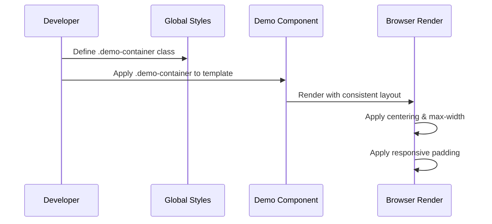
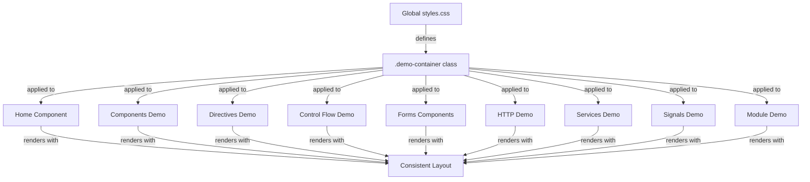

# Design Document: Consistent Demo Layout

## Overview

Standardize the layout wrapper across all demo component pages in the Angular 18 learning project to provide a consistent, centered user experience with proper max-width constraints and responsive padding.

## Main Algorithm/Workflow



## Core Interfaces/Types

```typescript
// CSS Class Definition
interface DemoContainerStyles {
  maxWidth: string; // "1200px"
  margin: string; // "0 auto" for centering
  padding: string; // "20px" base padding
  boxSizing: string; // "border-box"
}

// Component Template Pattern
interface DemoComponentTemplate {
  rootElement: string; // "div" with .demo-container class
  content: HTMLElement; // Component-specific content
}
```

## Key Functions with Formal Specifications

### Function 1: applyDemoContainer()

```typescript
function applyDemoContainer(element: HTMLElement): void;
```

**Preconditions:**

- `element` is a valid HTMLElement
- `element` is the root element of a demo component template

**Postconditions:**

- `element` has class "demo-container" applied
- Element renders with max-width: 1200px
- Element is horizontally centered (margin: 0 auto)
- Element has padding: 20px
- Layout is responsive on smaller screens

**Loop Invariants:** N/A (no loops in this function)

### Function 2: validateLayoutConsistency()

```typescript
function validateLayoutConsistency(components: DemoComponent[]): boolean;
```

**Preconditions:**

- `components` is an array of demo component instances
- Each component has a rendered template

**Postconditions:**

- Returns `true` if all components use .demo-container
- Returns `false` if any component lacks consistent layout
- No mutations to component instances

**Loop Invariants:**

- For validation loops: All previously checked components maintain their layout state

## Algorithmic Pseudocode

### Main Layout Standardization Algorithm

```pascal
ALGORITHM standardizeDemoLayouts(components)
INPUT: components - array of demo component file paths
OUTPUT: result - standardization result with success status

BEGIN
  ASSERT components is non-empty array

  // Step 1: Define global CSS class
  globalStyles ← createGlobalDemoContainerClass()
  ASSERT globalStyles contains required properties

  // Step 2: Update each component template
  FOR each component IN components DO
    ASSERT component.template exists

    // Check if component already has container
    IF hasInlineContainerStyles(component) THEN
      removeInlineStyles(component)
    END IF

    // Apply standard container class
    wrapTemplateWithContainer(component, "demo-container")

    ASSERT component.template starts with '<div class="demo-container">'
  END FOR

  // Step 3: Verify consistency
  allConsistent ← validateAllComponents(components)
  ASSERT allConsistent = true

  RETURN {success: true, componentsUpdated: components.length}
END
```

**Preconditions:**

- components array contains valid file paths
- All component files are accessible and writable
- Global styles file (styles.css) exists

**Postconditions:**

- All components use .demo-container class
- No inline layout styles remain in component templates
- Global styles.css contains .demo-container definition
- All components render with consistent layout

**Loop Invariants:**

- All previously processed components have .demo-container applied
- No component has conflicting inline styles
- Layout consistency is maintained throughout iteration

### Component Template Update Algorithm

```pascal
ALGORITHM wrapTemplateWithContainer(component, className)
INPUT: component - component file object
       className - CSS class name to apply
OUTPUT: updatedComponent - component with updated template

BEGIN
  ASSERT component.template is non-null
  ASSERT className is non-empty string

  template ← component.template

  // Check if already wrapped
  IF template starts with '<div class="' + className + '">' THEN
    RETURN component  // Already wrapped, no change needed
  END IF

  // Find root element
  rootElement ← findRootElement(template)

  // Case 1: Root has inline styles
  IF rootElement has style attribute THEN
    // Remove inline layout styles (padding, max-width, margin)
    cleanedRoot ← removeLayoutStyles(rootElement)

    // Add container class
    IF cleanedRoot has class attribute THEN
      cleanedRoot.class ← cleanedRoot.class + " " + className
    ELSE
      cleanedRoot.class ← className
    END IF

  // Case 2: Root has class with layout styles
  ELSE IF rootElement has class attribute THEN
    // Add container class
    rootElement.class ← rootElement.class + " " + className

  // Case 3: Root has no layout
  ELSE
    rootElement.class ← className
  END IF

  component.template ← updatedTemplate

  ASSERT component.template contains className

  RETURN component
END
```

**Preconditions:**

- component has valid template property
- className is a valid CSS class name
- Template is well-formed HTML

**Postconditions:**

- Component template root element has className applied
- Inline layout styles are removed
- Template remains valid HTML
- Component functionality is preserved

**Loop Invariants:** N/A (no loops in this algorithm)

## Example Usage

```typescript
// Example 1: Global CSS Definition (in styles.css)
.demo-container {
  max-width: 1200px;
  margin: 0 auto;
  padding: 20px;
  box-sizing: border-box;
}

// Responsive behavior for smaller screens
@media (max-width: 768px) {
  .demo-container {
    padding: 15px;
  }
}

@media (max-width: 480px) {
  .demo-container {
    padding: 10px;
  }
}

// Example 2: Component Template (Before)
@Component({
  template: `
    <div style="padding: 20px; max-width: 1200px; margin: 0 auto;">
      <h2>My Demo</h2>
      <!-- content -->
    </div>
  `
})

// Example 3: Component Template (After)
@Component({
  template: `
    <div class="demo-container">
      <h2>My Demo</h2>
      <!-- content -->
    </div>
  `
})

// Example 4: Component with existing class (Before)
@Component({
  template: `
    <div class="demo-section">
      <h2>My Demo</h2>
      <!-- content -->
    </div>
  `,
  styles: [`
    .demo-section {
      padding: 20px;
      max-width: 1200px;
      margin: 0 auto;
    }
  `]
})

// Example 5: Component with existing class (After)
@Component({
  template: `
    <div class="demo-container">
      <h2>My Demo</h2>
      <!-- content -->
    </div>
  `,
  styles: [`
    // Layout styles removed, only component-specific styles remain
  `]
})
```

## Architecture



## Components and Interfaces

### Component 1: Global Styles (styles.css)

**Purpose**: Define the standard .demo-container class for consistent layout across all demo pages

**Interface**:

```css
.demo-container {
  max-width: 1200px;
  margin: 0 auto;
  padding: 20px;
  box-sizing: border-box;
}
```

**Responsibilities**:

- Provide consistent max-width constraint (1200px)
- Center content horizontally (margin: 0 auto)
- Apply consistent padding (20px)
- Ensure box-sizing includes padding in width calculations
- Support responsive behavior for smaller screens

### Component 2: Demo Component Templates

**Purpose**: Apply the .demo-container class to root template elements

**Interface**:

```typescript
@Component({
  template: `
    <div class="demo-container">
      <!-- component-specific content -->
    </div>
  `
})
```

**Responsibilities**:

- Use .demo-container as root wrapper
- Remove inline layout styles
- Remove component-specific layout styles that duplicate .demo-container
- Maintain component-specific styling for non-layout concerns

## Data Models

### Model 1: DemoContainerConfig

```typescript
interface DemoContainerConfig {
  maxWidth: string; // "1200px"
  marginHorizontal: string; // "auto"
  marginVertical: string; // "0"
  padding: string; // "20px"
  boxSizing: string; // "border-box"
}
```

**Validation Rules**:

- maxWidth must be a valid CSS length value
- marginHorizontal should be "auto" for centering
- padding must be a valid CSS length value
- boxSizing should be "border-box" for consistent sizing

### Model 2: ComponentLayoutState

```typescript
interface ComponentLayoutState {
  componentName: string;
  hasInlineStyles: boolean;
  hasComponentStyles: boolean;
  usesDemoContainer: boolean;
  needsUpdate: boolean;
}
```

**Validation Rules**:

- componentName must be non-empty
- If usesDemoContainer is true, hasInlineStyles should be false
- needsUpdate is true when hasInlineStyles or !usesDemoContainer

## Error Handling

### Error Scenario 1: Missing Global Styles

**Condition**: styles.css file does not exist or is not accessible
**Response**: Create styles.css if missing, or append .demo-container definition if file exists
**Recovery**: Verify .demo-container class is defined before updating components

### Error Scenario 2: Component Template Parse Error

**Condition**: Component template is malformed or cannot be parsed
**Response**: Log error with component name and skip that component
**Recovery**: Continue processing remaining components, report failed components at end

### Error Scenario 3: Conflicting Styles

**Condition**: Component has existing styles that conflict with .demo-container
**Response**: Remove conflicting inline styles, preserve non-layout component styles
**Recovery**: Validate final rendered output matches expected layout

## Testing Strategy

### Unit Testing Approach

Test individual functions for layout standardization:

- Test CSS class definition generation
- Test template wrapper application
- Test inline style removal
- Test component style cleanup
- Test validation of layout consistency

Key test cases:

1. Apply .demo-container to component without existing layout
2. Replace inline styles with .demo-container class
3. Merge .demo-container with existing component classes
4. Remove duplicate layout styles from component styles
5. Validate responsive behavior at different breakpoints

### Property-Based Testing Approach

**Property Test Library**: fast-check (for TypeScript/Angular)

Properties to test:

1. **Idempotency**: Applying .demo-container multiple times produces same result
2. **Consistency**: All components using .demo-container render with identical layout constraints
3. **Preservation**: Component-specific content and functionality remain unchanged after layout standardization
4. **Responsiveness**: Layout adapts correctly at all viewport widths

### Integration Testing Approach

Test the complete workflow:

1. Define .demo-container in global styles
2. Update all demo component templates
3. Verify consistent rendering across all pages
4. Test responsive behavior at mobile, tablet, and desktop sizes
5. Verify no visual regressions in component-specific styling

## Performance Considerations

- Using a single global CSS class reduces CSS bundle size compared to inline styles
- Browser can cache and reuse .demo-container styles across all components
- Eliminates duplicate style definitions in component styles
- Minimal runtime performance impact (CSS class application is fast)

## Security Considerations

No security concerns for this feature. This is a purely presentational change affecting CSS layout only.

## Dependencies

- Angular 18 framework
- Global styles.css file
- All demo component files in src/app/features/

**External Dependencies**: None

**Internal Dependencies**:

- src/styles.css (global styles)
- src/app/features/home/home.component.ts
- src/app/features/components/components-demo.component.ts
- src/app/features/directives/directives-demo.component.ts
- src/app/features/control-flow/control-flow-demo.component.ts
- src/app/features/forms/reactive-form.component.ts
- src/app/features/forms/template-form.component.ts
- src/app/features/http/http-demo.component.ts
- src/app/features/services/services-demo.component.ts
- src/app/features/signals/signals-demo.component.ts
- src/app/features/module-based/module-demo.component.ts

## Correctness Properties

_A property is a characteristic or behavior that should hold true across all valid executions of a system—essentially, a formal statement about what the system should do. Properties serve as the bridge between human-readable specifications and machine-verifiable correctness guarantees._

### Property 1: All Demo Components Use Standard Layout Class

_For any_ demo component in the src/app/features/ directory, the component template's root element should have the "demo-container" CSS class applied.

**Validates: Requirements 3.1, 3.2, 3.3, 3.4, 3.5, 3.6, 3.7, 3.8, 3.9, 3.10**

### Property 2: Inline Layout Styles Are Removed

_For any_ demo component template that previously contained inline layout styles (max-width, margin, or padding), after standardization those inline styles should be removed and the demo-container class should be applied.

**Validates: Requirements 4.1, 4.2, 4.3, 4.4**

### Property 3: Component Style Cleanup Preserves Non-Layout Styles

_For any_ demo component with component-specific styles, after cleanup the component should have no duplicate layout properties (max-width, margin, padding) that match the demo-container definition, while all non-layout styles should be preserved unchanged.

**Validates: Requirements 5.1, 5.2, 5.3**

### Property 4: Validation Confirms Layout Consistency

_For any_ set of demo components, when validation is performed, it should confirm that all components use the demo-container class and none have conflicting inline layout styles.

**Validates: Requirements 6.1, 6.2, 6.4**

### Property 5: Content and Functionality Preservation

_For any_ demo component, after applying the demo-container class and removing duplicate layout styles, the component's content, non-layout styles, and TypeScript logic should remain unchanged.

**Validates: Requirements 7.1, 7.2, 7.3**

### Property 6: Consistent Visual Rendering

_For any_ demo component, when rendered in the browser, the content should be horizontally centered, constrained to a maximum width of 1200px, and have consistent padding applied, resulting in visually identical layout positioning and spacing across all demo pages.

**Validates: Requirements 8.1, 8.2, 8.3, 8.4**

### Property 7: Responsive Layout Adaptation

_For any_ viewport width, the demo-container should maintain centered content with appropriate padding: 20px for widths above 768px, 15px for widths between 481px and 768px, and 10px for widths 480px or below, while always constraining content to 1200px maximum width.

**Validates: Requirements 2.1, 2.2, 2.3**

### Property 8: Idempotent Standardization

_For any_ demo component, applying the layout standardization process multiple times should produce the same result as applying it once, with no additional changes to the template or styles.

**Validates: Requirements 4.4, 6.1**
